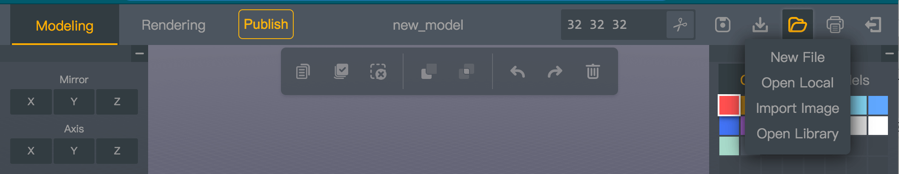

# Things About VoxelEditor

You can access VoxelEditor form [box3 website](https://box3.codemao.cn/), you will need to create a box3 account inorder to use this tool.
After you login, you can open it from the top tab bar or simply open this link: https://box3.codemao.cn/voxelEditor

## What is VoxelEditor ?

VoxelEditor is a 3d voxel model editor running on the web, it allow you to create and edit voxel model in your browser. It is one of the projects I developed at the CodeMao Company. After a long time of polishing, this product is  getting better and better. And it is also supported on mobile device.

Right now, It has become one of the wonderful tool on Box3 platform. People use it to create 3d model then put it in their game.

When you open the voxelEditor for the first time, it looks like this:

At top bar, you can toggle between Modeling mode and Rendering mode. Rename yor work, change the workspace size, save the file, download or open the local file.

On the left is editing tools set. The mose basic are 'Attach','Erase' and 'Paint', and the options of these tools. Below them are 'translate','selecte','magicWand', 'colorPicker', 'hollow out' and 'paint bucket' tools. 

On the right are color/material palettes and some preset models.
You can right click on the color item to change the color of that material. The color changing will be immediately shown on the model. You can also tweak the pbr attribute of the material, but all pbr attribute are only have effect in 'Rendering' mode.

A yellow heart with some purple light

In addition to these features, the tool has many more interesting features. On the [box3](https://box3.codemao.cn/) website, you can see many models made by users.

